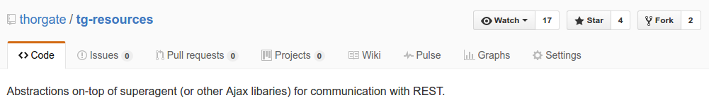

# tg-resources

Jürno Ader

- Twitter: [@jyrno42](https://twitter.com/jyrno42)
- GitHub: [github.com/jyrno42](https://github.com/jyrno42)
- Project: [thorgate/tg-resources](https://github.com/thorgate/tg-resources)
- Slides: [github.com/jyrno42/knowledge_tg_resources](https://github.com/jyrno42/knowledge_tg_resources)

Note:

    Hello! This is a quick intro to tg-resources. I'll also talk a bit about whats new in the freshly
    released version 1.0.

***

## What is tg-resources?

Note:

What is tg-resources and how does it help us?

---




Note:

In github tg-resources is marked as an abstraction on-top of superagent (or other
Ajax libraries) for communication w/ REST APIs.

---

## What does it give me?

- Promise based data-first API (which does not suck*)
- Tokenized endpoints w/ ES6 template syntax
- Resource grouping using routers

<small>* subjective opinion</small>

Note:

tg-resources provides a sane Promise based, data-first API for doing http requests in
nodejs or the browser. It has a builtin solution for Tokenized endpoints using ES6 syntax.
Resources can be also be grouped into an SDK by using the provided Routers.

---

## But wait, theres more!

- Sane error handling*
- ValidationError for the frontend


<small>* New in version 1.0</small>

Note:

tg-resources also has sane error handling and supports converting DRF error JSON to
a ValidationError object. This also nicely integrates w/ BaseForm used in various projects
in our company (leansite/krah/etk).

***

## Quick example

```js
// 1. Create the resource
const resource = new Resource('user/login');

// 2. Do a post request
resource.post(null, { user: 'foo', password: 'bar' }).then(user => {
    // Login succeeded
    console.log({
        type: 'LOGGED_IN',
        data: {
            user: user
        }
    });
}, error => {
    // Network error occurred
    if (error.isNetworkError) {
        console.error({
            type: 'NETWORK_FAILED',
            data: {
                error: error
            }
        });
    }

    // Handle error response
    else if (error.isValidationError) {
        console.error({
            type: 'LOGIN_FAILED',
            data: {
                message: error.firstError(true),
                error: error
            }
        });
    }

    // As a last resort, also handle invalid response codes
    else {
        console.error({
            type: 'SERVER_ERROR',
            data: {
                error: error
            }
        });
    }
});
```

***

## The future

- Replacing superagent w/ `window.fetch`
- Router improvements
- You tell me (issues/pull requests)

***

## Thank you

- Project: [thorgate/tg-resources](https://github.com/thorgate/tg-resources)
- Slides: [github.com/jyrno42/knowledge_tg_resources](https://github.com/jyrno42/knowledge_tg_resources)


Note:

Thanks everyone. Please take a look at the project in Github, use it, and let me know what caused you issues
or if you are missing some features.
